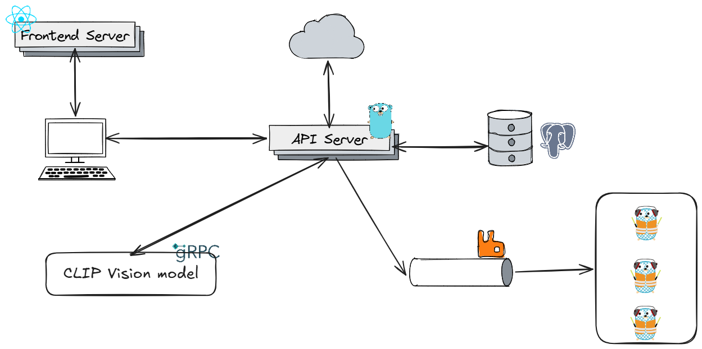
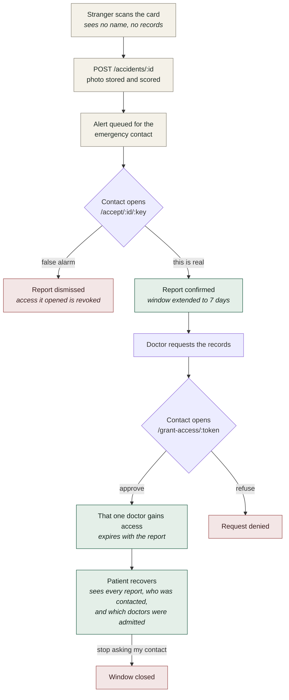

<p align="center">
  
</p>

<h1 align="center">ArogyaKhosh</h1>

<p align="center">
  Medical records with a consent model built for the moment the patient cannot speak.
</p>

ArogyaKhosh is an electronic health record system with two ways to authorise
access to a patient's documents. The ordinary one is familiar: a doctor asks,
the patient approves or refuses. The second exists for the case most systems
have no answer to, when the patient is unconscious and cannot approve anything.

Every patient carries a card with a QR code. Someone who finds them can scan it
and send a photograph of the scene. That alerts the contact the patient
nominated in advance, and from then on, for a bounded window, that contact can
approve a named doctor's request on the patient's behalf. The person who
scanned the code never sees a single medical record.

## Table of contents

- [Features](#features)
- [Quick start](#quick-start)
- [Architecture](#architecture)
- [The emergency flow](#the-emergency-flow)
- [Data model](#data-model)
- [Asynchronous mail delivery](#asynchronous-mail-delivery)
- [The accident classifier](#the-accident-classifier)
- [Classifier status](#classifier-status)
- [Security](#security)
- [API reference](#api-reference)
- [Development](#development)
- [Project layout](#project-layout)
- [License](#license)

## Features

**Patients** store medical documents, each marked public or private, and
approve, decline or revoke a named doctor's access at any time. They get a
printable emergency card with a working QR code, and a record of every accident
reported against them showing who was contacted and which doctors were admitted
as a result.

**Doctors** look up a patient by exact username or email, request access, and
track the status of every request they have made. They see only what they have
been granted.

**Whoever finds a patient** scans, photographs and sends. No account, no login,
and no visibility of the patient's records.

## Quick start

Requires Docker and Docker Compose. Nothing else.

```bash
git clone https://github.com/sathwikshetty33/ArogyaKhosh.git
cd ArogyaKhosh
cp .env.example .env
```

Set at minimum `JWT_SECRET` in `.env`:

```bash
openssl rand -base64 48
```

Then bring everything up and seed a working demo in one command:

```bash
make provision
```

That starts every service, waits for the API to report ready, creates the
demo accounts, and prints the credentials along with every URL worth opening.
It takes about thirty seconds from a stopped machine.

If you would rather start the stack without demo data:

```bash
docker compose up --build
```

| Service | Address |
|---|---|
| Frontend | http://localhost:3000 |
| API | http://localhost:8080 |
| RabbitMQ management UI | http://localhost:15673 |
| Postgres | localhost:5433 |
| Model service | localhost:50051 (gRPC) |

Postgres and RabbitMQ are published on 5433 and 5673 rather than their usual
ports, so they do not collide with instances already running on the host.

Migrations run automatically at startup. `GET /readyz` reports which
dependencies came up:

```json
{
  "status": "ready",
  "database": "up",
  "storage": "configured",
  "mail": "configured",
  "model": "configured",
  "queue": "up"
}
```

### Demo accounts

`make provision` creates one patient and three doctors, each doctor at a
different point of the access flow, so the consent behaviour has something to
show. All of them share the password `arogya-demo-2026`.

| Account | Role | State |
|---|---|---|
| `sathwik` | patient | owns three documents, one public |
| `anitarao` | doctor | access granted, expires in 48 hours |
| `vikrammenon` | doctor | request pending the patient's decision |
| `drtest` | doctor | request declined, sees the public document only |

The accounts are built through the public API rather than inserted directly, so
they carry real password hashes and have passed the same validation as any
signup. The script is re-runnable: it removes the four demo usernames first, so
a second run replaces the previous state instead of colliding with it.

`tools/creds.json` defines the demo rather than recording it. The script reads
that file and builds exactly what it describes, so editing it changes what gets
provisioned. Identifiers are assigned by the database and printed at the end of
a run, which is why they are not stored in the file and why running the script
never leaves the repository dirty.

```bash
make provision              # start everything and seed the demo
make creds                  # print the accounts and URLs again
SKIP_COMPOSE=1 make provision   # reseed without touching compose
```

Ports are read from `.env`, so the URLs it prints stay correct if you have
moved anything off the defaults.

### Make targets

| Target | Does |
|---|---|
| `make provision` | Start the stack and seed the demo accounts |
| `make creds` | Print the demo accounts from `tools/creds.json` |
| `make up` | `docker compose up -d --build` |
| `make down` | Stop the stack |
| `make logs` | Follow the backend logs |
| `make proto` | Regenerate the gRPC stubs for Go and Python |

### Optional configuration

Each of these degrades gracefully rather than preventing startup.

| Variable | Effect when unset |
|---|---|
| `SUPABASE_URL`, `SUPABASE_SERVICE_KEY`, `SUPABASE_BUCKET` | Document upload is disabled; everything else runs |
| `SMTP_HOST`, `SMTP_USERNAME`, `SMTP_PASSWORD`, `SMTP_FROM` | Mail is discarded instead of sent |
| `RABBITMQ_URL` | Mail is sent inline on the request, slower and with no retries |
| `AI_SERVICE_ADDR` | Accident photos are stored but not scored |
| `APP_BASE_URL` | Emailed links default to `http://localhost:3000` |

`AI_SERVICE_ADDR` and `RABBITMQ_URL` are read from inside the backend
container, so they use compose service names such as `ai:50051` and
`rabbitmq:5672`, not localhost.

## Architecture

<p align="center">
  
</p>

The Go API owns all state and every authorisation decision. It is the only
service that talks to Postgres, to object storage, or to the mail queue.

The Python service owns no state. It has no database connection, no
credentials, and no route to the internet. It receives image bytes over gRPC
and returns three numbers. Machine learning brings a large dependency tree, and
isolating it this way means a flaw anywhere in that tree still cannot reach a
medical record.

Outbound mail goes through RabbitMQ to a pool of Go workers, so no user request
ever waits on an SMTP handshake.

| Component | Technology |
|---|---|
| API | Go 1.26, Gin, GORM with versioned SQL migrations |
| Database | PostgreSQL 18, native `uuidv7()` primary keys |
| Object storage | Supabase Storage, private bucket, signed URLs only |
| Queue | RabbitMQ with a dead letter queue and tiered retries |
| Model service | Python, gRPC, CLIP with a linear probe |
| Frontend | React 19, Vite, Tailwind, React Router |

## The emergency flow

The QR code is static and encodes nothing secret, only `/report/<patient-id>`.
It has to be static, because the person scanning it is not the patient, so
anything requiring the patient's phone or password is useless in the only
situation the card exists for.



An unconfirmed report still routes doctor requests to the contact, on a
24 hour window rather than seven days, so a doctor is not blocked while the
contact has simply not opened their email yet.

Three rules keep this bounded:

**The classifier never gates anything.** If it is unavailable, rejects the
image, or is not configured, the report is still recorded and the contact is
still alerted, marked unscored. A model able to block an emergency alert would
be worse than no model.

**Every window closes.** An unconfirmed report authorises for 24 hours, because
it rests on a stranger's word alone. Confirming extends it to seven days.
Dismissal, closure, or the patient's own button ends it immediately.

**Dismissal and closure differ.** Dismissal means the report was mistaken, so
access it opened is revoked. Closure means the episode is over, and those
doctors did treat the patient, so their grants remain as history for the
patient to withdraw individually.

## Data model

```
users ──┬── patients ──┬── patient_documents
        │              ├── document_requests
        │              └── accidents
        └── doctors ───── hospitals
```

Primary keys are UUIDv7, which is time ordered, so identifiers behave like
sequential integers in an index while remaining safe to expose in a URL.

Access is resolved by a single function, `authz.PatientAccess`, which returns
one of four levels:

| Level | Who | Sees |
|---|---|---|
| `owner` | the patient | everything, plus who holds access |
| `granted` | a doctor with live consent | everything |
| `public` | any authenticated doctor | documents marked public only |
| `denied` | everyone else | 403 |

Consent reduces to one predicate:

```sql
status = 'granted' AND (expires_at IS NULL OR expires_at > now())
```

Two properties follow. Revocation takes effect on the doctor's next request,
because access is recomputed per request rather than cached in a session. And
expiry needs no background job, so there is no window in which a lapsed grant
still works because a sweeper is behind.

`document_requests.accident_id` records which report a request arrived under.
Dismissing a report revokes exactly the grants it opened, and leaves alone any
the patient made themselves.

Schema changes are versioned SQL files applied by gormigrate. `AutoMigrate` is
not used, as it cannot express the partial unique indexes and check constraints
this schema relies on.

## Asynchronous mail delivery

The emergency flow depends on two emails, and an SMTP handshake takes roughly
four seconds. Sending inline meant a bystander on mobile data waited five to
seven seconds for a response, and a send that failed had no second attempt.

Mail is now published to RabbitMQ and delivered by a pool of Go workers.

```
arogya.mail ──"send"──► mail.outbound        priority queue, 4 workers
                          │
                          │ rejected
                          ▼
arogya.mail.dlx ──► mail.retry.1m   ttl 60s     ─┐
                    mail.retry.5m   ttl 300s    ─┼─► dead letters back
                    mail.retry.25m  ttl 1500s   ─┘   to arogya.mail
                    mail.dead       terminal
```

The retry queues have no consumers. A message waits out its TTL and is dead
lettered back onto the main exchange, which is how AMQP performs delayed
redelivery without the delayed message plugin. After the ladder is exhausted a
message is parked in `mail.dead` for inspection.

Each worker holds its own AMQP channel, since `amqp.Channel` is not safe for
concurrent use, with a prefetch of one so the broker hands work to whichever
worker is free. Publishing waits for a broker confirmation.

| | Inline | Queued |
|---|---|---|
| Accident report | 5.1 to 7.7 s | 1.0 s |
| Doctor request during an open accident | 3.93 s | ~40 ms |
| Retry on failure | none | 1m, 5m, 25m, then DLQ |

Because a publish happens after the database commit, a process that dies in
between would leave an accident nobody was alerted about. `alert_queued_at`
distinguishes "the broker has it" from "it was delivered", and a periodic sweep
republishes any report that never reached the queue. It mints a fresh approval
key when it does, since only the hash of the original is stored.

## The accident classifier

The task is a single bit: does this photograph show a road accident. Not where
the vehicles are, not how many, not how badly anyone is hurt. The output is one
number that decides how urgent an email sounds, and a person reads that email
regardless.

### The approach

CLIP's vision encoder is frozen and used only to turn an image into 512
numbers. Logistic regression sits on top. Inference is one forward pass, one
dot product, one sigmoid.

CLIP was trained on hundreds of millions of image and caption pairs from the
open web, which include a great many photographs of crashes, crumpled bodywork,
emergency vehicles and debris. The encoder therefore separates those scenes
from ordinary traffic before this project begins, and nothing has to teach it
what a wreck looks like.

What remains is drawing one boundary through a space where the visual work is
already done. That needs very little training data, which mattered, because
only a few thousand labelled images were available.

The trained model is 513 numbers:

```json
{
  "clip_model": "openai/clip-vit-base-patch32",
  "embedding_dim": 512,
  "weights": [ "...512 floats..." ],
  "bias": 0.7905284925508785,
  "threshold": 0.6466099724683639
}
```

This buys four things:

- **Training takes minutes on a laptop.** No GPU, no fine tuning, no
  augmentation pipeline.
- **It cannot disguise a bad dataset.** A linear head on frozen features lacks
  the capacity to memorise its way to a good score, so implausible metrics are
  information rather than success.
- **The artifact is readable.** Two versions of the model can be compared in a
  text editor, and the threshold is a value in a file.
- **It runs on CPU with no network access.** The container installs a CPU only
  build of PyTorch and bakes the CLIP weights in with `HF_HUB_OFFLINE=1`. The
  image is large, around 3.7 GB, almost all of which is PyTorch.

The threshold targets 95 percent recall rather than best accuracy. A false
positive sends an email that a person dismisses; a false negative means nobody
is alerted. Those costs are not equal.

### Alternatives considered

- **YOLOv8, or object detection generally.** Reports that a car is present and
  where it is, which is not the same as an accident. Bridging boxes to a crash
  verdict needs bounding box annotations and handwritten rules over the output.
- **Fine tuning a ResNet or EfficientNet.** Workable, but requires a GPU,
  thousands of balanced images and a repeatable training run, to obtain a
  decision boundary in a feature space CLIP already provides.
- **CLIP zero shot with text prompts.** Needs no training data, but the score
  varies with prompt wording and there is no principled way to tune an
  operating point for recall.
- **A hosted vision API.** Per call cost, a third party receiving photographs
  of injured people, and a network dependency on the one path that must work
  when everything else is failing.

## Classifier status

Performance on the held out split of the training dataset.

| Metric | Value |
|---|---|
| Test images | 1,141 |
| True positives | 740 |
| False positives | 0 |
| True negatives | 399 |
| False negatives | 2 |
| Precision | 1.0000 |
| Recall | 0.9973 |
| Specificity | 1.0000 |
| Accuracy | 0.9982 |
| F1 | 0.9987 |
| ROC AUC | 1.0000 |
| PR AUC | 1.0000 |
| Operating threshold | 0.6466 |
| Target recall | 0.95 |
| Training images | 11,182 |

These figures describe the classifier against that dataset. Performance on
photographs from other sources has not been measured.

## Security

**A single authorisation choke point.** Every read of a patient resolves
through `authz.PatientAccess`. There is no second place where this is decided.

**Login does not reveal which accounts exist.** An unknown username would
otherwise return in nanoseconds while a real one took a full bcrypt comparison,
around 50 milliseconds, which is measurable over a network. A dummy hash is
verified on the miss path so both take the same time.

**Grant links are signed rather than stored or guessed.** A link containing
`hash(patient_id + doctor_id)` would be forgeable, because neither value is
secret: the patient id appears in the QR code and in dashboard URLs, and a
doctor knows their own. Any doctor could compute it and admit themselves
without the contact ever seeing an email. Instead:

```
payload = accident_id || request_id || expiry        40 bytes
token   = payload + "." + HMAC-SHA256(server_key, payload)
```

The identifiers travel in the clear, so the server knows exactly which request
to act on without a lookup table. The signature cannot be produced without the
server key, and the expiry is inside the signed bytes, so editing the URL
invalidates it. The signing key is domain separated from the session key, so a
grant token cannot be replayed as a login. Finality lives in the database:
only a pending request can be answered, which prevents an old email from
undoing a revocation.

**The approval key is stored only as a SHA-256 hash,** and the accident row is
looked up by that hash rather than by the identifier in the URL, so an invalid
key cannot be used to discover which accident identifiers exist.

**Storage keys never leave the server.** Documents are addressed by a generated
key and delivered as short lived signed URLs. Uploaded filenames are discarded.

**The storage bucket is private and its service key is server side only.** That
key bypasses Supabase's own row level security and must never reach a browser.

**Row level security is designed for rather than assumed.** The pieces it needs
are already in place: one choke point, consent expressed as a predicate, and
expiry evaluated at read time, so it can be adopted without reworking the
application.

## API reference

All routes are under `/api/v1`.

Public, reached from a QR code or an email link:

| Method | Path | Purpose |
|---|---|---|
| `POST` | `/accidents/:id` | Report an accident; photo and location optional |
| `GET` | `/accidents/:id/approval/:key` | The report an emergency contact is deciding on |
| `POST` | `/accidents/:id/approval/:key` | `confirm`, `dismiss` or `resolve` |
| `GET` | `/grants/:token` | Which doctor is requesting access |
| `POST` | `/grants/:token` | `grant` or `deny` |

Authentication:

| Method | Path | Purpose |
|---|---|---|
| `POST` | `/auth/register/patient` | Role is fixed by the endpoint, never read from the body |
| `POST` | `/auth/register/doctor` | As above |
| `POST` | `/auth/login` | Username or email, plus password |
| `GET` | `/me` | The current session's user and profile |

Patients:

| Method | Path | Purpose |
|---|---|---|
| `GET` | `/patients/:id` | The record, filtered by access level |
| `PATCH` | `/patients/:id` | Update vitals and emergency contact |
| `GET` | `/patients/:id/requests` | Access requests received; owner only |
| `GET` | `/patients/:id/accidents` | Reports and resulting access; owner only |
| `POST` | `/patients/:id/documents` | Upload a document |
| `POST` | `/patients/:id/requests` | A doctor requesting access |
| `GET` | `/patients/search` | Exact username or email |
| `POST` | `/accidents/:id/close` | Close an open report; owner only |

Documents and requests:

| Method | Path | Purpose |
|---|---|---|
| `GET` | `/documents/:id/url` | A short lived signed download URL |
| `PATCH` | `/documents/:id` | Rename, or change visibility |
| `DELETE` | `/documents/:id` | Delete |
| `POST` | `/requests/:id/approve` | Optional `expires_in_hours` |
| `POST` | `/requests/:id/decline` | Decline |
| `POST` | `/requests/:id/revoke` | Effective on the doctor's next request |

Patient search matches an exact username or email only. It is deliberately not
fuzzy: a doctor able to search on fragments would effectively hold a patient
directory.

## Development

Running the services individually:

```bash
# API
cd services/backend && go run .

# model service
cd services/ai && uv sync && uv run python server.py

# frontend
cd services/frontend && npm install && npm run dev
```

The Vite dev server proxies `/api` to the backend, so there is no CORS
configuration in development.

Regenerating the gRPC stubs for both languages from
`proto/ai_service.proto`:

```bash
make proto
```

`grpc_tools` bundles its own protoc, so no system protoc is required.

## Project layout

```
proto/                     the gRPC contract
assets/                    logo and architecture diagram
services/
  backend/                 Go, Gin, GORM
    internal/
      authz/               the single authorisation choke point
      auth/                JWT, bcrypt, approval keys, grant tokens
      mailer/              SMTP with header injection guards
      mailq/               RabbitMQ publisher, consumer and topology
      storage/             object storage behind an interface
      aiclient/            gRPC client for the model service
      models/              GORM models
      db/migrations/       versioned SQL applied by gormigrate
    server/                HTTP handlers, one file per area
  ai/                      Python gRPC service, stateless
    models/                classifier interface and the CLIP probe
    artifacts/             the trained head
  ml/notebooks/            the training notebook
  frontend/                React, Vite, Tailwind
```

## License

MIT. See [LICENSE](LICENSE).
